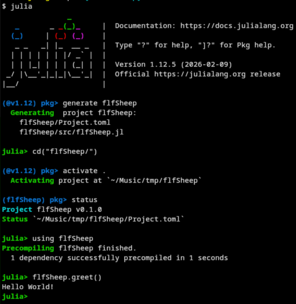

# Learning Julia the hard way

> This course is primarily designed for data scientists working on
> breeding and genetics.  People who want to use Julia for other
> purposes may also find it useful.  We will learn the development
> cycle of a Julia project.

## Preface

One can lift heavy weights as if they are light (in Chinese, 举重若轻),
to show its capability.  One can also lift light weights the way to
lift heavy weights (in Chinese, 举轻若重).  The latter is sometime
more meaningful, as:

- The readers here have most probably had some programming trainings
  before.
- We are dealing with *heavy* tasks more or less.
- The *hard* way shown here may serve the readers an easier life in
  the future.

### What you will learn

The main goal of this course is to instruct you to set up **a Julia
simulation project**, which uses packages that are under the umbrella
of `JuliaBnG`.

I will also show you how to

- [*Optional*] Configure `git` to control your project versions.
- Write, manage and build a `julia` project.
- Trace and test your `julia` project using `Revise.jl`.

Note that my configurations may not be optimal.  You may give me some
feedback and suggestions.

The bottom line of this tutorial is that you'd better make the
simulation package runnable on your own computer.

### Conventions

- External links will be opened in a new tab if clicked.
- Annotations will appear in the right most column if clicked.
- Inline codes are in `deep pink` color.

Please feel free to click the links, especially the annotations.

### Materials

- [JuliaBnG](https://github.com/JuliaBnG)
- [Fluffy sheep breeder](https://sheep-breeder-2.vercel.app/)
- ["Source code" of this
  instruction](https://github.com/JuliaBnG/nadas-course)
- The compiled instruction, as what you are reading.

## Introduction

### The task

The project we are going to deal with today is to design a breeding
program to tackle [Fluffy sheep
breeder](https://sheep-breeder-2.vercel.app/). The breeding task is
easy to carry out, as you can select arbitrary number of parents and
arbitrary weights on the two traits. The breeding will very likely go
on.  You might need to think more carefully to have your name appear
in the top shepherds.

### Setting up the environment

We are going to run some simulation to test our breeding programs.
Some script and tools in Julia are to be written for that.

We have already had Julia installed on our laptops.  But we are still
going through again to see if our environment is ready for heavy
lifting.

#### 1. Git

You'd better to have `git` [installed](annotation:git-installation)
and [configured](annotation:git-configuration).

#### 2. Terminal

We will test and run the project in a terminal.  Linux and MacOS users
can use the built-in terminal.  Windows users can use `Windows
Terminal` and WSL2, if possible.  Your terminal should be able to run
command `julia` and `git`.

#### 3. Julia

Once you have your terminal ready, whether you are using Linux, MacOS
or Windows, go through [Julia
installation](annotation:julia-installation) to make sure if you
`julia` is properly installed.

#### 4. Julia editor

*Julia editor* here doesn't refer to the editor you write your codes.
It is the one `julia` macro `@edit` invoks in the REPL.  Click
[here](annotation:julia-editor) to see if you want to know how a
function you are using is implemented.

#### 5. Working directory

It is a good habit to save your project in a working directory, e.g.,
`~/projects`.  Our project, which can be named as `flfSheep`, will be
saved in `~/projects/flfSheep`.

## The project

### The best practices

Let's talk about how a simulation is carried out.  [Stabilizing
Selection
Out-of-Africa](https://sashagusev.github.io/Stabilizing-Selection-Sim/)
shows an example that many programmers once dreamed of:

- A web interface
- Parameters that can be changed in GUI
- Click a button to start the simulation
- Wait for the simulation to finish
- Get the results in fancy plots

Sound nice?  Let think this twice.

A typical simulation of breeding practice may consist of the following
steps:

1. Generate a historical population to create linkage disequilibrium
   (LD).
2. Generate a bottleneck to mimic the founder effect.
3. Selection a few generations.
4. Selection with changed breeding schemes, e.g., with EBV from PBLUP
   to GBLUP.

One may think that the above steps can be standardized also, such that
we can list the parameters in a GUI, and then click a button to start
the simulation.  However, what if change the nuclear population
structure, e.g., from a single large population to a one that consists
many small flocks?  What if we change the mating rules?  Such
situations are numerous.

The breeding practices of different species are different.  The
practices of a same species raised in different countries may also
differ.  The art of breeding that varies from place to place and from
time to time makes script-based simulation more realistic.  The
established simulation procedure is fancy, change the simulation
routes and methods can be a nightmare.

> To be or not to be, that is a question.

is a famous line.  Organization of many of such lines makes many
scripts of different genres and styles.  A script is more versatile
and powerful than a GUI.

### Project analysis

We can take some numbers from the [Fluffy sheep
breeder](https://sheep-breeder-2.vercel.app/) webpage:

- $N_{\mathrm{ram}} = 50$
- $N_{\mathrm{ewe}} = 100$
- Two traits
  - Curliness
    - $\mu_0 = 100$
    - $\sigma_P = 10$
  - Wool length
    - $\mu_0 = 100$
    - $\sigma_P = 10$
- Final score seems to be final mean of the two traits minus 200.

It is likely that the wool length has higher heritability than
curliness.

Above are my observations.  Correct me if you find otherwise.

Our task is to write a Julia simulation package to run on our own
computer to find a breeding program that can achieve the highest score
possible.

### Development of the package

Before we start, make sure again that you have had your environment
setup as described in the previous section.  We will stay in the Julia
REPL until we finish the project.

#### 1. Create the project

In your terminal, go to the directory where you want to create the
project:

```bash
cd ~/projects  # or the directory you want to save your project
julia          # to enter Julia REPL
```

Type `]` to enter the package mode, and then type the following
commands:

```julia
generate flfSheep

# type <backspace> to exit the package mode, and back to the REPL
cd("flfSheep")  # to enter the project directory

# type `]` to enter the package mode again
activate .  # to activate the project we just created

# "(flfSheep) pkg>" is shown as the prompt
# type `status` to see the status of the project

# type `<backspace>` to exit the package mode
using flfSheep  # to load the project
```

Click the next link to see the [structure of the
project](annotation:project-structure).

We can see that there is a `greet` function in the `src/flfSheep.jl`
file.  Below is what you might see in your terminal:



Mean while, you might want to read the [almighty
tab](annotation:almighty-tab)

At this stage, you can use your favorite editor to edit the files in
the project directory.

#### 2. Add some `JuliaBnG` packages

In the REPL, type `]` to enter the package mode, and then type the
following command:

```julia
add BnGStructs           # from JuliaBnG
add DataFrames
add FisherWright         # from JuliaBnG
add Random
add RelationshipMatrices # from JuliaBnG
add StatsBase

# I haven't registered Breeding.jl in the General registry while writing this tutorial.
# You can add it by using the following command:
add https://github.com/JuliaBnG/Breeding.jl  # from JuliaBnG
```

Click the next link to see [what have
changed](annotation:what-have-changed).

#### 3. Write a test function

Refer [hello world project](annotation:hello-world-project) to make
sure that you have done the steps below correctly, as well as some
explanations.

Create a file `src/tstBreeding.jl` with the following content:

```julia
"""
  tstFlf()

Test scripts to find a good breeding program for the fluffy sheep.
"""
function tstFlf()
   @info "Starting the test function" 
end
```

Replace the line

```julia
greet() = print("Hello World!")
```

in `src/flfSheep.jl` with 

```julia
using BnGStructs
using Breeding
using DataFrames
using FisherWright
using Random
using RelationshipMatrices
using StatsBase

include("tstBreeding.jl")

export tstFlf
```

Up to now, although the package `flfSheep` doesn't do anything useful,
we have successfully created a package and added some dependencies to
it.  This is a package *Hello world*.  From this point, we can start
to write our own breeding program simulation, which might be a
`Hamlet` or `Macbeth` in breeding.

The rest of the tutorial all included in the `tstBreeding.jl` file,
which is shown in the next section.

## The simulation

I copied [a sample simulation
program](https://github.com/JuliaBnG/nadas-course/blob/main/tstBreeding.jl)
here with [explanations](annotation:simulation-annots).  You can
simply replace the file `src/tstBreeding.jl` in your project with the
sample file.  You can modify the file to suit your needs.

```julia line-numbers
"""
    founder_genotype(nid)

Generate genotypes and their linkage map for `nid` sheep.
"""
function founder_genotype(nid)
    @info "Return genotypes and a pedigree"

    # Generate a historic population using package `FisherWright`
    ne = nid + 50   # effective population size
    ng = 2000  # number of generations of random mating of `ne` ID
    mr = 1.0   # mutation rate per Morgan per meiosis
    sheep = Sheep(ne) # A Sheep Struct that define its name, pop size, chrs, and M

    mts, cbp = fisher_wright(
        ne,  # this function generate LD among SNPs
        ng,  # at mutation-drift equilibrium
        sheep.chromosome, # lengths in bp downloaded from NCBI
        mr;
        M = sheep.M,  # 10⁸ bp per Morgan
    )

    hxy, lmp = muts2bitarray(mts, cbp; flip = true)

    # Sample exclusive 20k chip SNP and 5k QTL. Sample 150 ID
    # - we sample 150 ID first
    maf = 0.0
    hxy, lmp = sampleID(hxy, lmp, maf, nid)

    # - sample chip SNP and QTL
    nchp, nqtl = 20_000, 5_000
    chip = SNPSet("chip", nchp; maf = 0.1, exclusive = true)
    qtl = SNPSet("qtl", nqtl; maf = 0.0, exclusive = true)
    hxy, lmp = sampleLoci(hxy, lmp, chip, qtl)
    lms = sum_map(sheep.chromosome)

    return hxy, lmp, lms
end

"""
    traits()

Define the traits of interest and their genetic VCV matrix.
"""
function traits()
    curliness = Trait("cn"; h² = 0.64, μ = 100.0, σₐ = 8)
    wlength = Trait("wl"; h² = 0.36, μ = 100.0, σₐ = 6)
    trts = [curliness, wlength]
    V = [ # genetic VCV matrix of these two traits
        64.0 -30
        -30 36  # r = -5/8, modify -30 if you want other r.
    ]
    return trts, V
end

"""
    pedigree(prt, trts)

Create an empty pedigree whose values are to be updated later.
"""
function pedigree(prt, trts, nram)
    nid = size(prt, 1)
    newe = nid - nram
    ped = DataFrame(
        id = Int32.(1:nid),
        sire = prt[:, 1],
        dam = prt[:, 2],
        generation = Int8.(0),
        sex = shuffle([zeros(Int8, newe); ones(Int8, nram)]),
        tmi = 0.0,
    )
    
    for pre in ("tbv_", "ft_", "ebv_")
        for t in trts
            ped[!, pre * t.name] .= 0.0
        end
    end
    ped
end

"""
    founder_pedigree(hxy, lmp, nram, trts, V)
    
Create the pedigree for generation 0 (the founder generation) with the
genotypes and the linkage map.  The QTL effects are sampled based on
the genetic VCV matrix `V` of the traits, and the TBV and phenotypes
are calculated based on the genotypes and the QTL effects.
"""
function founder_pedigree(hxy, lmp, nram, trts, V)
    eqtl(hxy, lmp, V, trts)  # sample the QTL effects for the two traits.
    nid = size(hxy, 2) ÷ 2
    ped = pedigree(zeros(Int32, nid, 2), trts, nram)
    tbv!(ped, hxy, lmp, trts)
    phenotype!(ped, trts)
    return ped
end

"""
    parents(ped, nram, newe)

Select parents from the last generation of the pedigree `ped` to breed
the next generation.  The sires and dams are selected based on their
TMI (total merit index) values from high to low.

Different breeding schemes can have different parents selection
strategies.  A new `parents` function can be implemented and plugged
in here.
"""
function parents(ped, nram, newe)
    # find the last generation of the pedigree 
    tpd = filter(row -> row.generation == ped.generation[end], ped)
    # select rams and ewes separately 
    spd = groupby(tpd, :sex)

    cnd = spd[(sex = 1,)]
    idx = sortperm(cnd.tmi, rev=true)[1:nram]
    rams = cnd.id[idx]

    cnd = spd[(sex = 0,)]
    idx = sortperm(cnd.tmi, rev=true)[1:newe]
    ewes = cnd.id[idx]

    nid = size(tpd, 1)

    # produce the same number of offspring as the last generation
    sires = StatsBase.sample(rams, nid; replace = true)
    dams = StatsBase.sample(ewes, nid; replace = true)
    sortslices([sires dams], dims = 1)
end

"""
    breeding_program(hxy, lmp, ped, lms, trts, V, nram, scenario; ngen = 5)

A breeding program to update the pedigree and select parents for the
next generation.  In this function, multiple trait BLUP is used to
update the EBV of the two traits, and the TMI is updated based on the
EBV.  The parents are selected based on the TMI values.
"""
function breeding_program(hxy, lmp, ped, lms, trts, V, nram, scenario; ngen = 5)
    for gen in 1:ngen
        @info "Generation $gen"

        # Inverse of the numerator relationship matrix
        Ai = Ainv(ped)

        # update EBV using multiple trait BLUP
        mtpblup(ped, trts, Ai, V)

        # update TMI
        ped.tmi = scenario.w * ped.ebv_cn + (1 - scenario.w) * ped.ebv_wl

        # select parents based on TMI
        prt = parents(ped, scenario.nram, scenario.newe)

        # placeholder for offspring genotypes
        off = falses(size(hxy, 1), size(prt, 1) * 2)

        # simulate genotypes for offspring
        gene_drop(hxy, off, prt, lms, lmp.pos)

        # temporary pedigree for the next generation
        tpd = pedigree(prt, trts, nram)

        # calculate TBV for offspring
        tbv!(tpd, off, lmp, trts)
        
        # calculate phenotypes for offspring
        phenotype!(tpd, trts)

        # update generation number for offspring
        tpd.generation .= gen

        # update ID for offspring
        tpd.id .+= ped.id[end]

        # update pedigree with offspring
        append!(ped, tpd)

        # update genotypes with offspring
        hxy = hcat(hxy, off) 
    end

    return ped
end

"""
    report(ped, Ai)
Report the average score and inbreeding coefficient of the last
generation in the pedigree `ped` based on the numerator relationship
matrix `Ai`.
"""
function report(ped)
    @info "The final score and inbreeding coefficient of the last generation"
    lg = groupby(ped, :generation)[(generation = ped.generation[end],)]
    @info "  - Score: ", round(mean(lg.tbv_cn) + mean(lg.tbv_wl), digits = 2)
    ic = 0.0
    A = nrm(ped)
    for id in lg.id
        ic += A[id, id] - 1
    end
    ic /= size(lg, 1)
    @info "  - Inbreeding coefficient: ", round(ic, digits = 3)
end

"""
    tstFlf()

Tests program to find a good breeding scheme for Fluffy sheep.  In
this function, brute force loops can be used to find a breeding plan
to reach high score on https://sheep-breeder-2.vercel.app/.
"""
function tstFlf()
    @info "Start testing..."

    @info "  - Generate genotypes, linkage map, traits, and pedigree for generation 0"
    nram, newe = 50, 100
    hxy, lmp, lms = founder_genotype(nram + newe)

    trts, V = traits()
    ped = founder_pedigree(hxy, lmp, nram, trts, V)

    scenario = (nram = 25, newe = 50, w = 0.5)

    # keep a copy of the original data for testing different scenarios
    cxy, cmp, cpd = copy(hxy), copy(lmp), copy(ped)

    @info "Scenario: " scenario
    tpd = breeding_program(cxy, cmp, cpd, lms, trts, V, nram, scenario)
    report(tpd)
end
```

## Final remarks

I hope you have enjoyed this tutorial.  Below are some more topics that I want
to address a few words.

### About AI

The template for this tutorial was written by AI.  It is one prompt for my first
2-column webpage.  I prompted a few more to reach this final format.  You can
download all the "source codes" of this tutorial from its `JuliaBnG` [github
page](https://github.com/JuliaBnG/nadas-course).  For example:

```bash
git clone https://github.com/JuliaBnG/nadas-course
```

AI can't be avoided for people who are actively working today.  My argue for AI
are one, 

> The AI products that have made a huge exodus of computer science
> students and work forces must be effective to some extent.  They are
> also at our fingertips.

Two,

> AI is a multiplier and assistant.  Its power depends on the user.
> If a user knows nothing, AI can't do much.  The more you know, the
> more AI can do for you.  You ask the right questions or propose
> proper prompts.

### The simulation packages

Not all of my simulatin codes will be open-sourced.  The main reason is I need
funding to have it organized.  


---

*This tutorial was written in February 2026.*

by *Dr. Xijiang Yu*

*Last updated: February 25, 2026*
