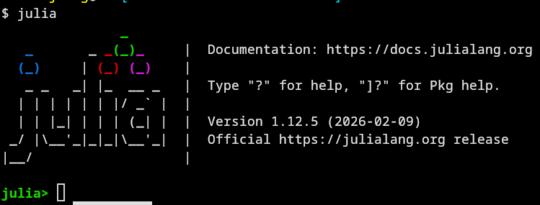

# Julia installation

The best way install Julia is to run the following command in your terminal:

```bash
curl -fsSL https://install.julialang.org | sh
```

This will install the latest stable version of `Julia`, as well as the `juliaup`
tool. Start Julia from the command-line by typing `julia`. You will then enter the `julia` REPL (Read-Eval-Print Loop).  You will see something like this:



Type `]` to enter the package manager mode. 

```julia
add Revise
```

Then type `ctrl-d` to exit `julia` REPL.

Create a file in your home directory called `.julia/config/startup.jl` with the following content:

```julia
using Revise
```

Later, when you start `julia`, `Revise` will be loaded automatically.

`Revise` is a must-have tool for Julia developers.  It allows you to modify your
code and see the changes immediately without restarting Julia.  We will use it
throughout this course.
